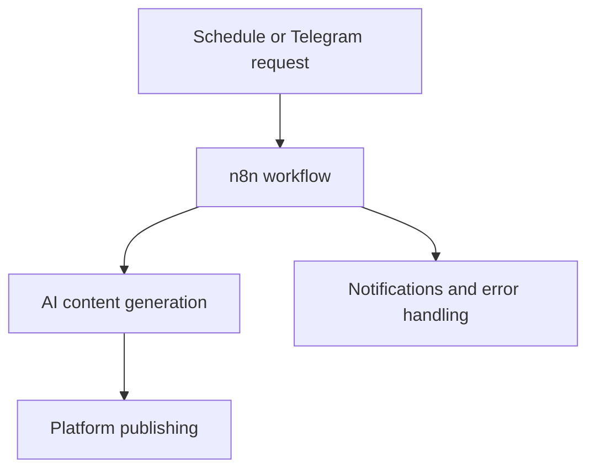

# AI-Powered Automated Social Media Content Scheduler

## Overview

This final year project is an AI-assisted workflow automation system that generates, schedules, and publishes social media content. It combines n8n workflows, APIs, generative AI services, and a Telegram chatbot to reduce repetitive content-management tasks.

## Objectives

- Automate content generation and scheduled publishing
- Support multiple social platforms through one workflow system
- Provide chatbot-based control and notifications
- Handle failures through centralized error-management logic

## Tools and Technologies

- n8n workflow automation
- REST APIs and webhooks
- Telegram Bot API
- Large language models and generative-media APIs
- X, Threads, YouTube Shorts, and Telegram integrations

## System Flow

## Key Implementation Work

- Created schedule triggers, conditional logic, and parallel workflows in n8n.
- Integrated AI modules for captions, images, and short-form video content.
- Developed a Telegram chatbot with text and voice interaction.
- Added real-time system notifications and content-theme management.
- Designed centralized error handling to make troubleshooting easier.

## Skills Demonstrated

- Workflow design and automation
- API integration
- Systems thinking and troubleshooting
- AI-service integration
- Testing and technical documentation

## Evidence to Add

- Sanitized n8n workflow screenshot
- System architecture diagram
- Telegram chatbot demonstration
- Sample content generated with non-sensitive test data
- Short project demonstration video

## Security Note

API keys, webhook URLs, tokens, account identifiers, and credentials must be removed before any workflow export or screenshot is published.

