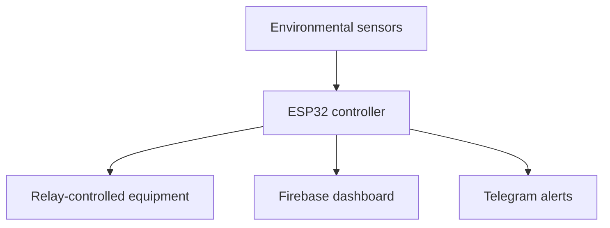

# Oyster Mushroom Farm Monitoring System Using IoT

## Overview

This group design project monitors and controls environmental conditions in an oyster mushroom farm. The system uses an ESP32, multiple sensors, relay-controlled equipment, Firebase, and Telegram alerts to support remote monitoring and automated environmental control.

## Monitored Conditions

- Temperature
- Humidity
- Carbon dioxide level
- Light intensity
- Water level

## Automated Equipment

- Humidifier
- Exhaust fan
- Blower
- Lighting

## Tools and Technologies

- ESP32 microcontroller
- Environmental and water-level sensors
- Relay modules
- Firebase dashboard and cloud data logging
- Telegram bot notifications
- Solar-powered operation

## System Flow

## My Contributions

- Supported overall IoT system design and sensor integration.
- Implemented automated relay-based environmental control.
- Developed remote monitoring through Firebase.
- Added Telegram alerts for real-time system notifications.
- Participated in testing, troubleshooting, and project presentation.

## Results and Recognition

- Gold Medal and Best Award at X-CIPTA 2025
- Gold Medal at IDPEX 2025
- Demonstrated automated monitoring, remote visibility, and energy-conscious operation

## Skills Demonstrated

- IoT architecture and hardware integration
- Sensor data handling
- Cloud dashboards and notifications
- Automation and troubleshooting
- Team collaboration and presentation

## Evidence to Add

- System block diagram
- Prototype photographs
- Firebase dashboard screenshot using sample data
- Telegram alert screenshot
- Award certificates

