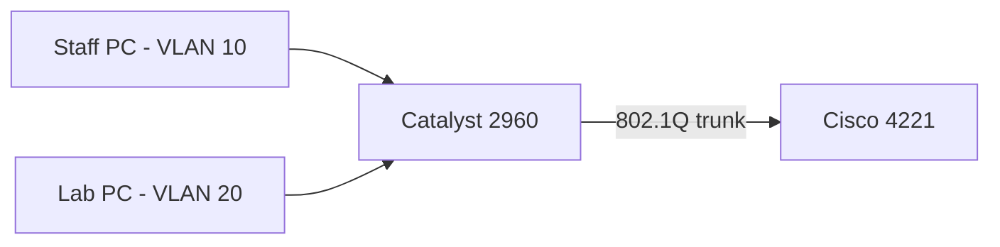

# Lab 01: VLAN Segmentation and Inter-VLAN Routing

## Objective

Create two VLANs on a Cisco Catalyst 2960 switch and route traffic between them using a Cisco 4221 router with router-on-a-stick configuration.

## Topology



## Addressing Plan

| Device | Interface | VLAN | IPv4 address | Default gateway |
| --- | --- | ---: | --- | --- |
| R1 | G0/0/0.10 | 10 | 192.168.10.1/24 | Not applicable |
| R1 | G0/0/0.20 | 20 | 192.168.20.1/24 | Not applicable |
| Staff PC | NIC | 10 | 192.168.10.10/24 | 192.168.10.1 |
| Lab PC | NIC | 20 | 192.168.20.10/24 | 192.168.20.1 |

## Switch Port Plan

- FastEthernet0/1 to FastEthernet0/12: VLAN 10
- FastEthernet0/13 to FastEthernet0/24: VLAN 20
- GigabitEthernet0/1: 802.1Q trunk to R1

## Configuration Files

- [Cisco 2960 switch configuration](../../configs/SW1-vlan-config.txt)
- [Cisco 4221 router configuration](../../configs/R1-router-on-a-stick.txt)

## Verification Commands

On SW1:

```text
show vlan brief
show interfaces trunk
show interfaces status
```

On R1:

```text
show ip interface brief
show running-config interface GigabitEthernet0/0/0.10
show running-config interface GigabitEthernet0/0/0.20
```

Connectivity tests:

```text
Staff PC> ping 192.168.10.1
Staff PC> ping 192.168.20.10
Lab PC> ping 192.168.20.1
Lab PC> ping 192.168.10.10
```

## Expected Result

Both PCs should reach their default gateways and communicate across VLANs through R1. If the same-VLAN gateway ping succeeds but the cross-VLAN ping fails, check the trunk, router subinterfaces, VLAN assignments, and host gateways.

## Troubleshooting Checklist

1. Confirm both VLANs exist on SW1.
2. Confirm access ports are assigned to the correct VLAN.
3. Confirm G0/1 is operating as a trunk.
4. Confirm VLANs 10 and 20 are allowed on the trunk.
5. Confirm R1 G0/0/0 is enabled.
6. Confirm both router subinterfaces use the correct 802.1Q VLAN ID.
7. Confirm PC addresses, masks, and gateways match the addressing table.

## Evidence to Add After Testing

- Packet Tracer topology screenshot
- `.pkt` file
- Successful ping results
- `show vlan brief` and `show interfaces trunk` output
- Short troubleshooting reflection

